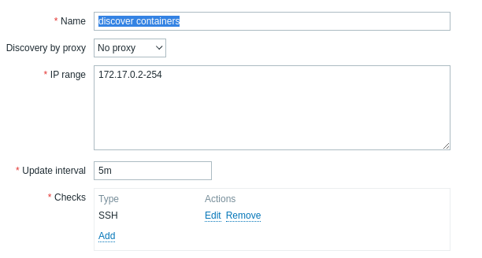
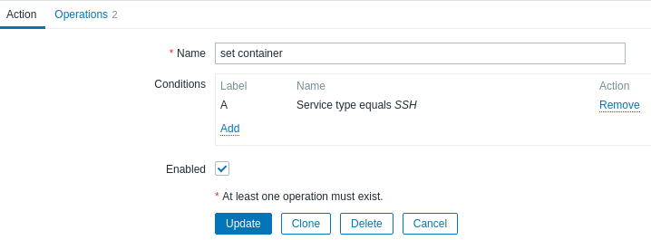

# Dynamic Inventory in Ansible
Set up a third party application, such a Zabbix, for managing dynamic inventory of containers
## Setup Zabbix 
```shell
cd 
docker run -d --name db -e POSTGRES_PASSWORD=password  -v /opt/postgres:/var/lib/postgresql/data \
  -p 5432:5432  systemdevformations/docker-postgres12
wget https://repo.zabbix.com/zabbix/5.3/ubuntu/pool/main/z/zabbix-release/zabbix-release_5.3-1+ubuntu20.04_all.deb
sudo dpkg -i zabbix-release_5.3-1+ubuntu20.04_all.deb
sudo apt update
sudo apt install -y zabbix-server-pgsql zabbix-frontend-php php7.4-pgsql zabbix-apache-conf zabbix-sql-scripts zabbix-agent
```
## Copy a sql script inside the db container 
```shell
cd /usr/share/doc/zabbix-sql-scripts/postgresql
docker cp create.sql.gz db:/tmp/create.sql.gz  
```

## Configure zabbix database 
```sql
CREATE DATABASE zabbix;
CREATE ROLE zabbix WITH LOGIN ENCRYPTED PASSWORD 'zabbix';
```

## Install zabbix tables and data
```shell
# using portainer, open a console on the db container 
adduser zabbix
su - zabbix
cd /tmp 
zcat create.sql.gz | psql 
```

Change the password of zabbix_server accordingly  
```/etc/zabbix/zabbix_server.conf```  

Set up the web interface   
```http://<ip>/zabbix``` 

Password is Admin/zabbix


## Configure Zabbix auto discovery 
Go to Configuration -> Discovery -> Create Discovery Rule   
  

Check in Monitoring -> Hosts


Add actions   


Add Operations  


Add another container  
```docker run -d --name target11 systemdevformations/ubuntu_ssh:v2```

## FYI - For getting the containers ip addresses
```sql
select i.ip,h.name from hosts h, interface i, hosts_groups g
where h.hostid = i.hostid and h.hostid = g.hostid and h.status=0 and g.groupid = 5;
```
## zabbix.py is using Zabbix API
Go to the directory zabbix.
```shell
chmod +x zabbix.py 
ZABBIX_TEMPLATES='Linux by Zabbix agent' ansible-playbook -i get_inventory.py ../ansible_ping.yml
 ```
